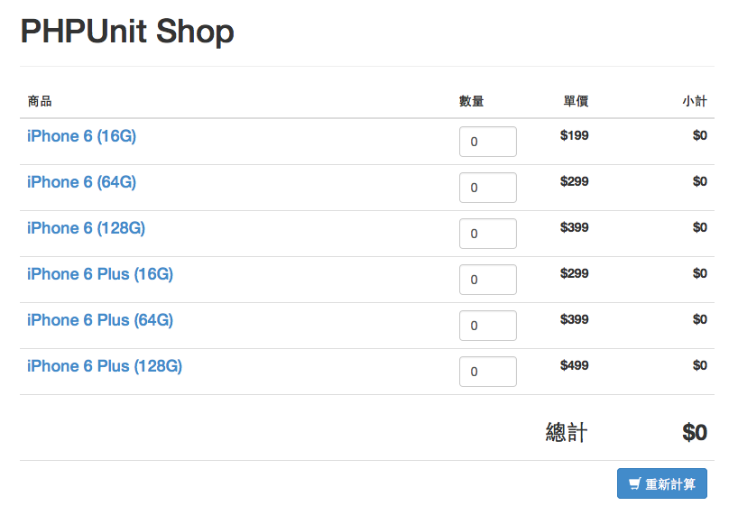

# 準備本書範例

接下來我們將會用一個簡易計價程式範例來介紹 PHPUnit ，以下是這個範例的相關準備工作。

## 下載專案範例

1. 至 GitHub 下載以下網址的檔案： https://github.com/jaceju/book-phpunit-in-action-examples/archive/master.zip 。

2. 將下載的 zip 解壓縮到 `C:\project` 目錄，此為我們的專案目錄。

## 編輯專案範例

1. 開啟 Sublime Text 。

2. 將專案目錄拖曳到 Sublime Text 側欄上。

## 執行範例

開啟命令列工具，並執行下列指令：

```dos
C:\> cd project
C:\project> php -S localhost:9999 -t .
PHP 5.5.11 Development Server started at Sun Sep 14 16:40:17 2014
Listening on http://localhost:9999
Document root is C:\project
Press Ctrl-C to quit.
```

這將會啟動一個位址為 `http://localhost:9999/` 的 PHP 內建 Web Server ，方便我們做網站的測試。畫面如下：


