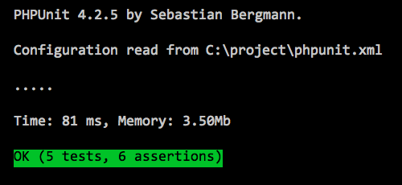

# PHPUnit 設定檔

PHPUnit 執行測試時，是有選項可以設定的。我們可以在專案根目錄中建立一個名為 `phpunit.xml` 的 XML 檔案，把設定寫在裡面，讓 `phpunit` 執行時有所依據。

如果目前所在的工作目錄下，有 `phpunit.xml` 或 `phpunit.xml.dist` (照此順序找) 的 XML 檔，而且也沒有在 `phpunit` 指令中加入 `--configuration` 選項，那麼 `phpunit` 就會自動從前面的 XML 檔案讀取設定來執行。

## `phpunit.xml` 範例

常見的 `phpunit.xml` 範例如下：

```xml
<?xml version="1.0" encoding="UTF-8" ?>
<phpunit
    bootstrap="./bootstrap.php"
    colors="true">
    <testsuites>
        <testsuite name="Cart Test Suite">
            <directory phpVersion="5.3.0" phpVersionOperator=">=">./tests/</directory>
            <file>./vendor/someone/mylib/tests/MyClassTest.php</file>
        </testsuite>
    </testsuites>
</phpunit>
```

## 常用設定

以下列出幾個常見的設定：

* `bootstrap`

 在執行測試之前，先執行 `bootstrap` 指定的檔案，其路徑相對於 `phpunit.xml` 。 `bootstrap` 指定的檔案通常會執行自動載入類別、定義測試會用到的常數、設定執行環境等。

* `colors` 

 讓 `phpunit` 指令的輸出 ANSI 色彩化；例如測試都成功的時候， `OK` 的背景會是一條綠色光棒。在 Windows 環境下的命令列不支援 ANSI 色彩，可使用 [ANSICON](https://github.com/adoxa/ansicon) 或 [ConEmu](https://github.com/Maximus5/ConEmu) 。 
 
 
 
* `testsuites` 

 `<testsuites>` 可以包含一個或多個 `<testsuite>` 子標籤，然後將測試案例與測試套件組合成更大的測試套件。
 
* `testsuite`

 `testsuite` 可以包含一到多個 `directory` 或 `file` 子標籤，來決定要測試的資料夾或檔案。它們都可以加入 `phpVersion` 及 `phpVersionOperator` 屬性，以參考 PHP 版本來決定是不是要執行該資料夾或檔案裡的測試。

## 官方手冊參考

* [Chapter 3. The Command-Line Test Runner](https://phpunit.de/manual/current/zh_cn/textui.html)

* [Chapter 5. Organizing Tests](https://phpunit.de/manual/current/en/organizing-tests.html)

* [Appendix C. The XML Configuration File](https://phpunit.de/manual/current/en/appendixes.configuration.html)
 
## 練習

* 
