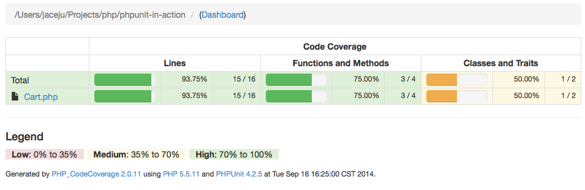
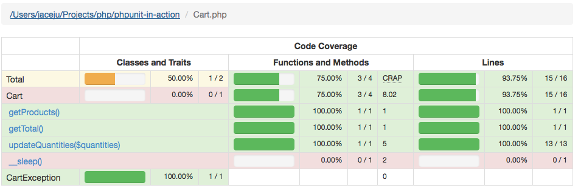
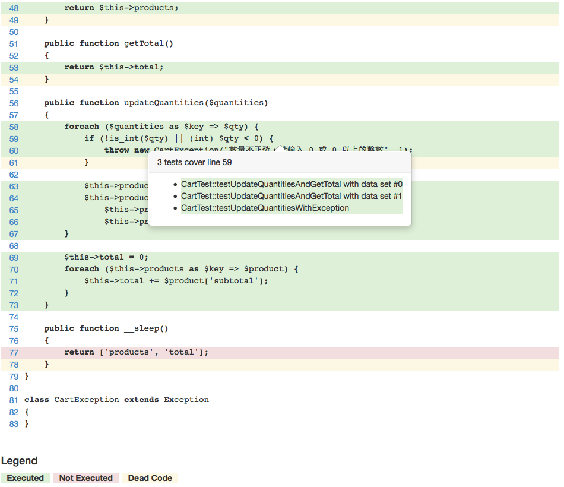
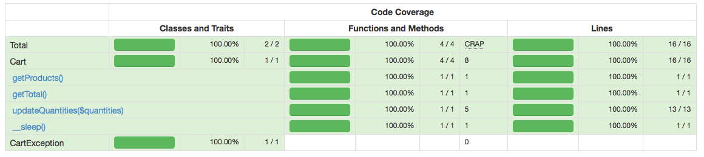

# 程式碼的覆蓋率

當程式架構大到一個程度時，我們需要一個數據來確保關鍵程式都被測試到，而這個數據稱為程式碼覆蓋率。通常在測試執行完成後，就可以產生出一份覆蓋率報告，讓我們看到測試已經涵蓋了程式的哪些部份。

## 加入覆蓋率報告

在安裝 Xdebug 後， PHPUnit 就能支援產生覆蓋率報告的功能。產生覆蓋率報告的方式有兩種：

1. 在執行 `phpunit` 指令時，加上 `--coverage-html` 選項，並指定輸出路徑：

 ```dos
 C:\project> phpunit --coverage-html ./report tests
 PHPUnit 4.2.5 by Sebastian Bergmann.

 .....

 Time: 262 ms, Memory: 6.75Mb

 OK (5 tests, 6 assertions)

 Generating code coverage report in HTML format ... done
 ```

2. 在 `phpunit.xml` 的 `testsuites` 後面加入以下設定：

 ```xml
    <logging>
        <log type="coverage-html"
            target="./report"
            charset="UTF-8"
            highlight="false"
            lowUpperBound="35"
            highLowerBound="70" />
    </logging>
    <filter>
        <blacklist>
            <directory>/path/to/.composer</directory>
        </blacklist>
    </filter>
 ```

 `logging` 與 `log` 表示要使用的報告格式； `filter` 是過濾覆蓋的範圍，可以用 `blacklist` 子標籤 來去掉不想覆蓋的目錄或檔案。

 接著執行 `phpunit` ，就會得到相同的結果。

## 檢視報告

打開 `report` 目錄下的 `index.html` 就會看到 HTML 格式的報告：



在專案目錄頁中，可以看到每一個 PHP 程式程式碼的覆蓋率，總共可分為三個等級：

 * `Low: 0% to 35%`
 * `Medium: 35% to 70%`
 * `High: 70% to 100%`

再點選 `Cart.php` 後，會可以看到更詳細的 `Cart` 類別覆蓋率報告：



如果測試有執行到某個方法，那麼這個方法就會被標示成覆蓋，並顯示它覆蓋的行數。

再往下看就可以看到實際程式碼覆蓋的情形，會用顏色標註出來：



當游標移過覆蓋的程式碼時，就會跳出一個小提示框，告訴開發者是哪一個測試覆蓋到這段程式碼。

## 加強覆蓋率

從報告中，我們可以看到 `__sleep` 方法中的程式碼呈現紅色，這表示這段程式碼並沒有被測試到。所以我們可以加入一個新測試來確保這段程式碼的動作是正常的：

```php
<?php

class CartTest extends PHPUnit_Framework_TestCase
{
    // ...

    public function testSerialize()
    {
        $serial = serialize($this->cart);
        $cart = unserialize($serial);
        $this->assertEquals($cart, $this->cart);
    }
}
```

再執行一次 `phpunit` ，並重新檢視報告，就會看到覆蓋率變成 100% 了。



## 官方手冊參考

* [Chapter 11. Code Coverage Analysis](https://phpunit.de/manual/current/zh_cn/code-coverage-analysis.html)

## 練習

* 思考看看覆蓋率一定要 100% 嗎？

* 試著改用其他非 HTML 格式的覆蓋率報告選項，並看懂它的分析。
