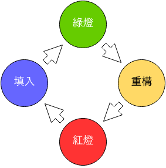

# 測試保障重構

當系統越來越複雜，而我們很難對目前的程式新增或修改功能，或著是程式中有一些壞味道出現時，就需要對程式進行重構。

簡單來說，重構就是整理我們的程式碼，讓它更加乾淨。而重構最重要的，是不能改變程式碼原有的功能；換句話說，不論我們怎麼改，原有的測試都要通過。

## 重構流程

我們可以把重構視為是一個循環，每個循環結束後，程式碼都要保持原有的功能。

重構的循環有幾個階段，分別為綠燈、重構、紅燈、填入。



所以當我們要執行「重構」的步驟之前，程式一定要在「綠燈」狀態，也就是測試全部成功的狀態。

## 重構 `Cart` 類別

在 `Cart::updateQuantities` 方法裡，我們可以看到幾個很類似的程式片段，這就是一種重複程式碼的壞味道：

```php

    public function updateQuantities($quantities)
    {
        // 更新商品數量並算出小計
        foreach ($quantities as $key => $qty) {

            // ... 略

            $this->products[$key]['quantity'] = $qty;
            $this->products[$key]['subtotal'] =
                $this->products[$key]['quantity'] *
                $this->products[$key]['price'];
        }

        // 計算總金額
        $this->total = 0;
        foreach ($this->products as $key => $product) {
            $this->total += $product['subtotal'];
        }

        // 運費
        if ($this->total < 500) {
            $this->products[self::FREIGHT_KEY]['quantity'] = 1;
            $this->products[self::FREIGHT_KEY]['subtotal'] =
                $this->products[self::FREIGHT_KEY]['quantity'] *
                $this->products[self::FREIGHT_KEY]['price'];

            // 加上運費
            $this->total += $this->products[self::FREIGHT_KEY]['subtotal'];
        } else {
            $this->products[self::FREIGHT_KEY]['quantity'] = 0;
            $this->products[self::FREIGHT_KEY]['subtotal'] =
                $this->products[self::FREIGHT_KEY]['quantity'] *
                $this->products[self::FREIGHT_KEY]['price'];
        }
    }
```

我們可以透過重構中的 Extract Method 來整理它們。

## Extract Method

先從看起來有很多類似的程式碼片段開始，把以下程式碼複製下來：

```php
$this->products[$key]['quantity'] = $qty;
$this->products[$key]['subtotal'] =
    $this->products[$key]['quantity'] *
    $this->products[$key]['price'];
```

獨立成一個 `setQuantity` 方法：

```php
public function setQuantity($key, $qty)
{
    $this->products[$key]['quantity'] = $qty;
    $this->products[$key]['subtotal'] =
        $this->products[$key]['quantity'] *
        $this->products[$key]['price'];
}
```

然後把原來的程式碼片段改用 `setQuantity` 方法：

```php
public function updateQuantities($quantities)
{
    // 更新商品數量並算出小計
    foreach ($quantities as $key => $qty) {
        if (!is_numeric($qty) || (int) $qty < 0) {
            throw new CartException("$key, $qty, 數量不正確，請輸入 0 或 0 以上的整數", 1);
        }

        $this->setQuantity($key, $qty); // 取代原有的程式碼
    }

    // ... 略
}
```

接著執行測試，應該是一切無誤。

這時候如果有使用版本控制系統的話，就應該做一次 commit ；重構就是小步前進，以不破壞整體系統運作為原則。

## 改用新方法

有了 `setQuantity` 方法後，我們就可以把類似的片段以它來取代。

```php
// 運費
if ($this->total < 500) {
    $this->products[self::FREIGHT_KEY]['quantity'] = 1;
    $this->products[self::FREIGHT_KEY]['subtotal'] =
        $this->products[self::FREIGHT_KEY]['quantity'] *
        $this->products[self::FREIGHT_KEY]['price'];

    // 加上運費
    $this->total += $this->products[self::FREIGHT_KEY]['subtotal'];
} else {
    $this->products[self::FREIGHT_KEY]['quantity'] = 0;
    $this->products[self::FREIGHT_KEY]['subtotal'] =
        $this->products[self::FREIGHT_KEY]['quantity'] *
        $this->products[self::FREIGHT_KEY]['price'];
}
```

改成：

```php
// 運費
if ($this->total < 500) {
    $this->setQuantity(self::FREIGHT_KEY, 1);
    $this->total += $this->products[self::FREIGHT_KEY]['subtotal'];
} else {
    $this->setQuantity(self::FREIGHT_KEY, 0);
}
```

再次執行測試，一切是這麼美好，程式碼也清楚多了。

## 練習

* 找找看 `Cart` 類別還有什麼壞味道可以重構？

* 思考看看測試在這裡扮演的角色是什麼？
