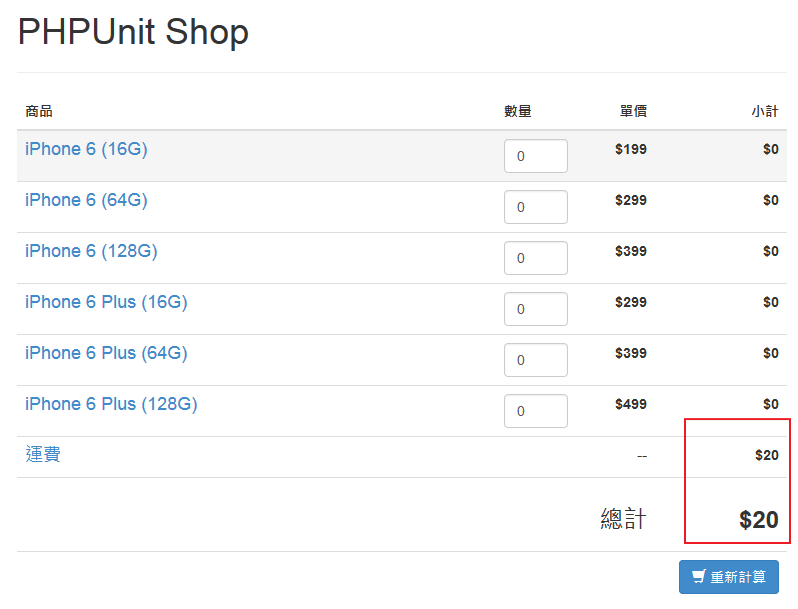

# 處理用戶回饋的錯誤

有些 bug 是上線後才被用戶發現，通常這表示我們的思考不夠周延，但進行亡羔補牢的工作也為時不晚。

當用戶回報 bug 後，除了重現 bug 之外，我們也需要確保它未來不會再發生。

## 用戶回報的 bug

在用戶操作我們的程式數次之後，他發現了以下的結果：



原因就在於他把所有商品數量都改成 0 之後再送出，就發現出現了不應該出現的運費。

當然如果是按照規格來實作與驗收時，是不應該出現這個 bug 的。但可能因為我們的疏忽，而導致了它的出現。

所以我們應該要修正它，以下是處理的方式。

## 針對 bug 撰寫測試

當我們接收到問題時，第一步該做的，就是寫一個測試來驗證它。

首先我們在 `CartTest::provider` 方法中，加入一組數量和總計都為 0 的測試數據：

```php
public function provider()
{
    return [
        // ... 略
        [ [ 0, 0, 0, 0, 0, 0 ], 0 ],
    ];
}
```

接著執行測試：

```dos
C:\project> phpunit
PHPUnit 4.2.6 by Sebastian Bergmann.

Configuration read from C:\project\phpunit.xml

..F....

Time: 568 ms, Memory: 8.00Mb

There was 1 failure:

1) CartTest::testUpdateQuantitiesAndGetTotal with data set #2 (array(0, 0, 0, 0,
 0, 0), 0)
Failed asserting that 20 matches expected 0.

C:\project\tests\CartTest.php:27

FAILURES!
Tests: 7, Assertions: 8, Failures: 1.
```

果然發生了非預期的結果，這表示我們的程式碼確實有邏輯上的錯誤。回頭檢查了 `Cart::updateQuantities` 方法，發現我們判斷總金額來加入運費的邏輯沒有考慮到總金額為 0 的狀況。

```php
if ($this->total < 500) {
    // ... 略
}
```

修正如下：

```php
if ($this->total > 0 && $this->total < 500) {
    // ... 略
}
```

再執行一次測試，就會發現測試成功了， bug 宣告解決。

## 練習

* 思考看看，除了運費的 bug 外，還有沒有其他 bug ？

* 思考看看，有沒有什麼方法可以預先防止這種 bug 發生？
